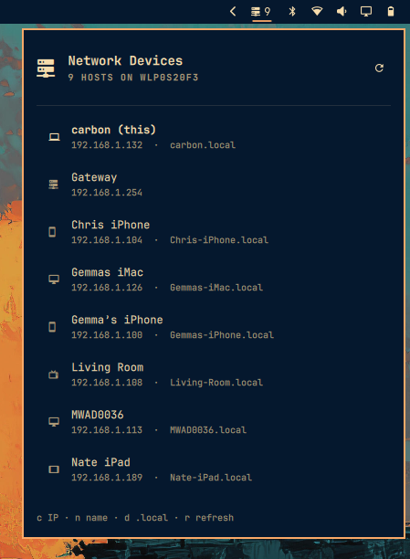

# Network Devices

Browse machines discovered on your local network from the Omarchy Quattro bar.

Uses **mDNS** (`avahi-browse`) so each host can show:

- a friendly name
- IPv4 address
- `.local` hostname when advertised



## Install

```sh
omarchy plugin add https://github.com/intrepid-developer/omarchy-network-devices.git --enable
```

## Usage

- Left click — open / close the host list
- Middle click — refresh now
- In the panel: `j` / `k` move, Enter copies IP
- `c` copy IP · `n` copy name · `d` copy `.local` · `r` refresh
- Click a row to copy its IP · right-click to copy `.local`

IPC:

```sh
omarchy-shell shell summon network-devices.plugin '{}'
omarchy-shell shell hide network-devices.plugin
```

## Configure

| Key | Default | What it does |
|---|---|---|
| `refreshIntervalSec` | `60` | How often to rescan (15–600) |
| `showCount` | `On` | Show the host count next to the bar icon |

```sh
omarchy bar set network-devices.plugin refreshIntervalSec 30
omarchy bar set network-devices.plugin showCount Off
omarchy bar move network-devices.plugin --section right
```

## Requirements

- `avahi` / `avahi-browse` on `PATH`
- `wl-copy` for clipboard actions
- Python 3 (for `bin/lan-hosts`)

## Remove

```sh
omarchy plugin remove network-devices.plugin
```

## License

MIT — see [LICENSE](LICENSE).
